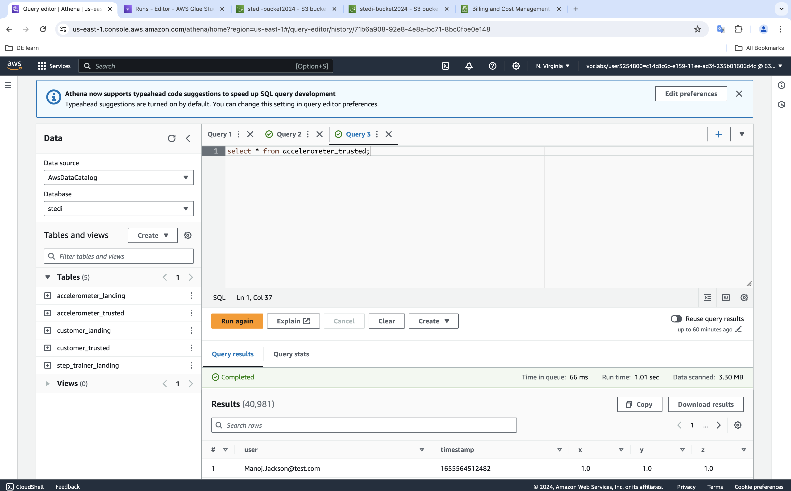

# PROJECT 3: STEDI Human Balance Analytics

## Introduction:
As you have learned in this course Spark and AWS Glue allow you to process data from multiple sources, categorize the data, and curate it to be queried in the future for multiple purposes. In this project you will directly use the skills you have used, including some of the code you have already written.

You will go beyond that to write additional AWS Glue jobs to create curated step trainer data that can be used for machine learning.
## Target:

In this project, you'll act as a data engineer for the STEDI team to build a data lakehouse solution for sensor data that trains a machine learning model.

As a data engineer on the STEDI Step Trainer team, you'll need to extract the data produced by the STEDI Step Trainer sensors and the mobile app, and curate them into a data lakehouse solution on AWS so that Data Scientists can train the learning model.
## Detail:

The STEDI Team has been hard at work developing a hardware STEDI Step Trainer that:

trains the user to do a STEDI balance exercise;
and has sensors on the device that collect data to train a machine-learning algorithm to detect steps;
has a companion mobile app that collects customer data and interacts with the device sensors.
STEDI has heard from millions of early adopters who are willing to purchase the STEDI Step Trainers and use them.

Several customers have already received their Step Trainers, installed the mobile application, and begun using them together to test their balance. The Step Trainer is just a motion sensor that records the distance of the object detected. The app uses a mobile phone accelerometer to detect motion in the X, Y, and Z directions.

The STEDI team wants to use the motion sensor data to train a machine learning model to detect steps accurately in real-time. Privacy will be a primary consideration in deciding what data can be used.
## Project Results:

### Landing Zone:

#### `customer_landing.sql`
```
    CREATE EXTERNAL TABLE IF NOT EXISTS `stedi`.`customer_landing` (
        `customerName` string,
        `email` string,
        `phone` string,
        `birthDay` string,
        `serialNumber` string,
        `registrationDate` bigint,
        `lastUpdateDate` bigint,
        `shareWithResearchAsOfDate` bigint,
        `shareWithPublicAsOfDate` bigint,
        `shareWithFriendsAsOfDate` bigint
    )
    ROW FORMAT SERDE 'org.openx.data.jsonserde.JsonSerDe'
    WITH SERDEPROPERTIES (
        'ignore.malformed.json' = 'FALSE',
        'dots.in.keys' = 'FALSE',
        'case.insensitive' = 'TRUE',
        'mapping' = 'TRUE'
    )
    STORED AS INPUTFORMAT 'org.apache.hadoop.mapred.TextInputFormat' OUTPUTFORMAT 'org.apache.hadoop.hive.ql.io.HiveIgnoreKeyTextOutputFormat'
    LOCATION 's3://stedi-bucket2024/customer/landing/'
    TBLPROPERTIES ('classification' = 'json');

```

#### `accelerometer_landing.sql`
```
    CREATE EXTERNAL TABLE IF NOT EXISTS `stedi`.`accelerometer_landing` (
        `user` string,
        `timeStamp` bigint,
        `x` float,
        `y` float,
        `z` float
    )
    ROW FORMAT SERDE 'org.openx.data.jsonserde.JsonSerDe'
    WITH SERDEPROPERTIES (
        'ignore.malformed.json' = 'FALSE',
        'dots.in.keys' = 'FALSE',
        'case.insensitive' = 'TRUE',
        'mapping' = 'TRUE'
    )
    STORED AS INPUTFORMAT 'org.apache.hadoop.mapred.TextInputFormat' OUTPUTFORMAT 'org.apache.hadoop.hive.ql.io.HiveIgnoreKeyTextOutputFormat'
    LOCATION 's3://stedi-bucket2024/accelerometer/landing/'
    TBLPROPERTIES ('classification' = 'json');

```
#### `step_trainer_landing.sql`
```
    CREATE EXTERNAL TABLE IF NOT EXISTS `stedi`.`step_trainer_landing` ( 
        `sensorReadingTime` bigint, 
        `serialNumber` string, 
        `distanceFromObject` int
    )
    ROW FORMAT SERDE 'org.openx.data.jsonserde.JsonSerDe'
    WITH SERDEPROPERTIES ( 
        'ignore.malformed.json' = 'FALSE', 
        'dots.in.keys' = 'FALSE', 
        'case.insensitive' = 'TRUE', 
        'mapping' = 'TRUE'
    )
    STORED AS INPUTFORMAT 'org.apache.hadoop.mapred.TextInputFormat' OUTPUTFORMAT 'org.apache.hadoop.hive.ql.io.HiveIgnoreKeyTextOutputFormat'
    LOCATION 's3://stedi-bucket2024/step_trainer/landing/'
    TBLPROPERTIES ('classification' = 'json')

```

#### `Count of customer_landing: 956 rows`


#### `Count of accelerometer_landing: 81273 rows`


#### `Count of step_trainer_landing: 28680 rows`


### Trusted Zone:

#### `customer_landing_to_trusted.py`
```
    import sys
    from awsglue.transforms import *
    from awsglue.utils import getResolvedOptions
    from pyspark.context import SparkContext
    from awsglue.context import GlueContext
    from awsglue.job import Job
    import re

    args = getResolvedOptions(sys.argv, ['JOB_NAME'])
    sc = SparkContext()
    glueContext = GlueContext(sc)
    spark = glueContext.spark_session
    job = Job(glueContext)
    job.init(args['JOB_NAME'], args)

    # Script generated for node Customer Landing
    CustomerLanding_node1685352066932 = glueContext.create_dynamic_frame.from_options(format_options={"multiline": False}, connection_type="s3", format="json", connection_options={"paths": ["s3://stedi-bucket2024/customer/landing/customer-1691348231425.json"], "recurse": True}, transformation_ctx="CustomerLanding_node1685352066932")

    # Script generated for node PrivacyFilter
    PrivacyFilter_node1718579583577 = Filter.apply(frame=CustomerLanding_node1685352066932, f=lambda row: (not(row["sharewithresearchasofdate"] == 0)), transformation_ctx="PrivacyFilter_node1718579583577")

    # Script generated for node Customer Trusted
    CustomerTrusted_node1685352920969 = glueContext.write_dynamic_frame.from_options(frame=PrivacyFilter_node1718579583577, connection_type="s3", format="json", connection_options={"path": "s3://stedi-bucket2024/customer/trusted/", "partitionKeys": []}, transformation_ctx="CustomerTrusted_node1685352920969")

    job.commit()
```

#### `accelerometer_landing_to_trusted.py`
```
    import sys
    from awsglue.transforms import *
    from awsglue.utils import getResolvedOptions
    from pyspark.context import SparkContext
    from awsglue.context import GlueContext
    from awsglue.job import Job

    args = getResolvedOptions(sys.argv, ['JOB_NAME'])
    sc = SparkContext()
    glueContext = GlueContext(sc)
    spark = glueContext.spark_session
    job = Job(glueContext)
    job.init(args['JOB_NAME'], args)

    # Script generated for node Accelerometer
    Accelerometer_node1718614319067 = glueContext.create_dynamic_frame.from_catalog(database="stedi", table_name="accelerometer_landing", transformation_ctx="Accelerometer_node1718614319067")

    # Script generated for node Customer Trusted
    CustomerTrusted_node1718614320397 = glueContext.create_dynamic_frame.from_catalog(database="stedi", table_name="customer_trusted", transformation_ctx="CustomerTrusted_node1718614320397")

    # Script generated for node Join
    Join_node1718614477330 = Join.apply(frame1=CustomerTrusted_node1718614320397, frame2=Accelerometer_node1718614319067, keys1=["email"], keys2=["user"], transformation_ctx="Join_node1718614477330")

    # Script generated for node Select Fields
    SelectFields_node1718630890323 = SelectFields.apply(frame=Join_node1718614477330, paths=["z", "y", "x", "timestamp", "user"], transformation_ctx="SelectFields_node1718630890323")

    # Script generated for node Accelerometer Trusted
    AccelerometerTrusted_node1718614522741 = glueContext.write_dynamic_frame.from_options(frame=SelectFields_node1718630890323, connection_type="s3", format="json", connection_options={"path": "s3://stedi-bucket2024/accelerometer/trusted/", "partitionKeys": []}, transformation_ctx="AccelerometerTrusted_node1718614522741")

    job.commit()
```

#### `step_trainer_landing_to_trusted.py`
```
    import sys
    from awsglue.transforms import *
    from awsglue.utils import getResolvedOptions
    from pyspark.context import SparkContext
    from awsglue.context import GlueContext
    from awsglue.job import Job
    from awsglue import DynamicFrame

    def sparkSqlQuery(glueContext, query, mapping, transformation_ctx) -> DynamicFrame:
        for alias, frame in mapping.items():
            frame.toDF().createOrReplaceTempView(alias)
        result = spark.sql(query)
        return DynamicFrame.fromDF(result, glueContext, transformation_ctx)
    args = getResolvedOptions(sys.argv, ['JOB_NAME'])
    sc = SparkContext()
    glueContext = GlueContext(sc)
    spark = glueContext.spark_session
    job = Job(glueContext)
    job.init(args['JOB_NAME'], args)

    # Script generated for node Step Trainer Landing
    StepTrainerLanding_node1718607143662 = glueContext.create_dynamic_frame.from_options(format_options={"multiline": False}, connection_type="s3", format="json", connection_options={"paths": ["s3://stedi-bucket2024/step_trainer/landing/"], "recurse": True}, transformation_ctx="StepTrainerLanding_node1718607143662")

    # Script generated for node Customer Trusted
    CustomerTrusted_node1718607141884 = glueContext.create_dynamic_frame.from_catalog(database="stedi", table_name="customer_trusted", transformation_ctx="CustomerTrusted_node1718607141884")

    # Script generated for node SQL Query
    SqlQuery0 = '''
    SELECT STL.*, CT.*
    FROM STL INNER JOIN CT
    ON STL.serialnumber = CT.serialnumber
    '''
    SQLQuery_node1718641365439 = sparkSqlQuery(glueContext, query = SqlQuery0, mapping = {"STL":StepTrainerLanding_node1718607143662, "CT":CustomerTrusted_node1718607141884}, transformation_ctx = "SQLQuery_node1718641365439")

    # Script generated for node Select Fields
    SelectFields_node1718612994805 = SelectFields.apply(frame=SQLQuery_node1718641365439, paths=["serialnumber", "sensorreadingtime", "distancefromobject", "sensorReadingTime", "serialNumber", "distanceFromObject"], transformation_ctx="SelectFields_node1718612994805")

    # Script generated for node Step Trainer Trusted
    StepTrainerTrusted_node1718610839029 = glueContext.write_dynamic_frame.from_options(frame=SelectFields_node1718612994805, connection_type="s3", format="json", connection_options={"path": "s3://stedi-bucket2024/step_trainer/trusted/", "partitionKeys": []}, transformation_ctx="StepTrainerTrusted_node1718610839029")

    job.commit()
```

#### `Count of customer_trusted: 482 rows`


#### `Count of accelerometer_trusted: 40981 rows`


#### `Count of step_trainer_trusted: 14460 rows`


### Curated Zone:

#### `customer_trusted_to_curated.py`
```
    import sys
    from awsglue.transforms import *
    from awsglue.utils import getResolvedOptions
    from pyspark.context import SparkContext
    from awsglue.context import GlueContext
    from awsglue.job import Job
    from awsglue.dynamicframe import DynamicFrame
    from pyspark.sql import functions as SqlFuncs

    args = getResolvedOptions(sys.argv, ['JOB_NAME'])
    sc = SparkContext()
    glueContext = GlueContext(sc)
    spark = glueContext.spark_session
    job = Job(glueContext)
    job.init(args['JOB_NAME'], args)

    # Script generated for node Accelerometer
    Accelerometer_node1718614319067 = glueContext.create_dynamic_frame.from_catalog(database="stedi", table_name="accelerometer_landing", transformation_ctx="Accelerometer_node1718614319067")

    # Script generated for node Customer Trusted
    CustomerTrusted_node1718614320397 = glueContext.create_dynamic_frame.from_catalog(database="stedi", table_name="customer_trusted", transformation_ctx="CustomerTrusted_node1718614320397")

    # Script generated for node Join
    Join_node1718614477330 = Join.apply(frame1=CustomerTrusted_node1718614320397, frame2=Accelerometer_node1718614319067, keys1=["email"], keys2=["user"], transformation_ctx="Join_node1718614477330")

    # Script generated for node Drop Fields
    DropFields_node1718677088729 = DropFields.apply(frame=Join_node1718614477330, paths=["z", "y", "x", "timestamp", "user"], transformation_ctx="DropFields_node1718677088729")

    # Script generated for node Drop Duplicates
    DropDuplicates_node1718677220682 =  DynamicFrame.fromDF(DropFields_node1718677088729.toDF().dropDuplicates(), glueContext, "DropDuplicates_node1718677220682")

    # Script generated for node Customer Curated
    CustomerCurated_node1718614522741 = glueContext.write_dynamic_frame.from_options(frame=DropDuplicates_node1718677220682, connection_type="s3", format="json", connection_options={"path": "s3://stedi-bucket2024/customer/curated/", "partitionKeys": []}, transformation_ctx="CustomerCurated_node1718614522741")

    job.commit()
```

#### `machine_learning_trusted_to_curated.py`
```
    import sys
    from awsglue.transforms import *
    from awsglue.utils import getResolvedOptions
    from pyspark.context import SparkContext
    from awsglue.context import GlueContext
    from awsglue.job import Job
    from awsglue.dynamicframe import DynamicFrame
    from awsglue import DynamicFrame
    from pyspark.sql import functions as SqlFuncs

    def sparkSqlQuery(glueContext, query, mapping, transformation_ctx) -> DynamicFrame:
        for alias, frame in mapping.items():
            frame.toDF().createOrReplaceTempView(alias)
        result = spark.sql(query)
        return DynamicFrame.fromDF(result, glueContext, transformation_ctx)
    args = getResolvedOptions(sys.argv, ['JOB_NAME'])
    sc = SparkContext()
    glueContext = GlueContext(sc)
    spark = glueContext.spark_session
    job = Job(glueContext)
    job.init(args['JOB_NAME'], args)

    # Script generated for node Accelerometer Trusted
    AccelerometerTrusted_node1718614319067 = glueContext.create_dynamic_frame.from_catalog(database="stedi", table_name="accelerometer_trusted", transformation_ctx="AccelerometerTrusted_node1718614319067")

    # Script generated for node Step Trainer Trusted
    StepTrainerTrusted_node1718678812991 = glueContext.create_dynamic_frame.from_catalog(database="stedi", table_name="step_trainer_trusted", transformation_ctx="StepTrainerTrusted_node1718678812991")

    # Script generated for node SQL Query
    SqlQuery0 = '''
    SELECT ACC.*, ST.*
    FROM ACC INNER JOIN ST
    ON ACC.timestamp = ST.sensorReadingTime;
    '''
    SQLQuery_node1718679290110 = sparkSqlQuery(glueContext, query = SqlQuery0, mapping = {"ACC":AccelerometerTrusted_node1718614319067, "ST":StepTrainerTrusted_node1718678812991}, transformation_ctx = "SQLQuery_node1718679290110")

    # Script generated for node Drop Duplicates
    DropDuplicates_node1718677220682 =  DynamicFrame.fromDF(SQLQuery_node1718679290110.toDF().dropDuplicates(), glueContext, "DropDuplicates_node1718677220682")

    # Script generated for node Machine Learning Curated
    MachineLearningCurated_node1718614522741 = glueContext.write_dynamic_frame.from_options(frame=DropDuplicates_node1718677220682, connection_type="s3", format="json", connection_options={"path": "s3://stedi-bucket2024/step_trainer/curated/", "partitionKeys": []}, transformation_ctx="MachineLearningCurated_node1718614522741")

    job.commit()
```

#### `Count of customer_curated: 482 rows`


#### `Count of machine_learning_curated: 43681 rows`


